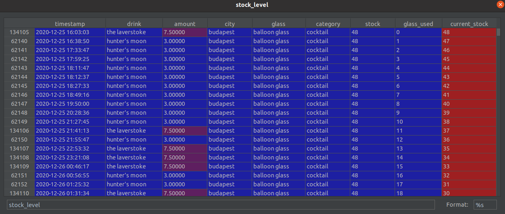

# Instructions

## Set up

To get going run the following:

- Install the requirements

```
pip install -r requirements.txt
```

- Run build_database.py

```
python3 build_database.py
```

## Explanation

- The data_tables.SQL creates the base tables in the database
- build_database.py will load all the files in the data folder, clean, transform and then load them into the tables mentioned in the first step.
- The same file will then combine those tables together to make the poc_tables. This table is called current_glass_stock and makes it easier for the analyst to query current stock levels instead of having to all the join themselves.
- Although this tables is denormalised this does not impact performance given how small the data is.

## Table Examples

Below shows what the data_tables.SQL will look like:


While the next image show you what the joined table used for analysis looks like:

- You will see here that the current_stock column tells you the stock less the cumulative use of that glass within each city.
- If this approaches 0 or goes negative then the bar is running out of that type of glass and it is a sign to restock.

